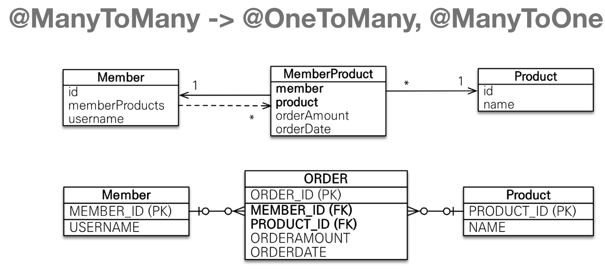
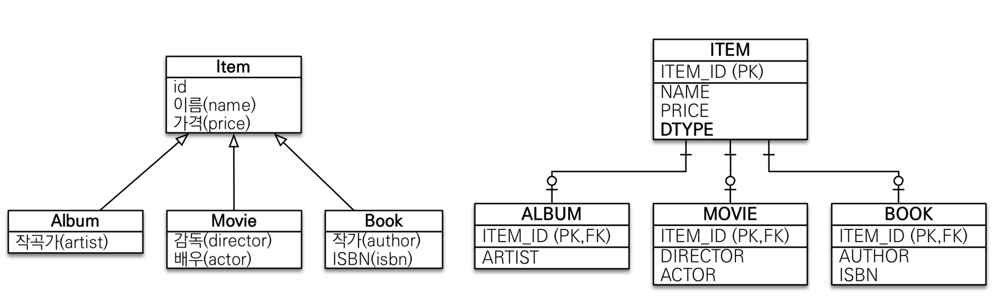
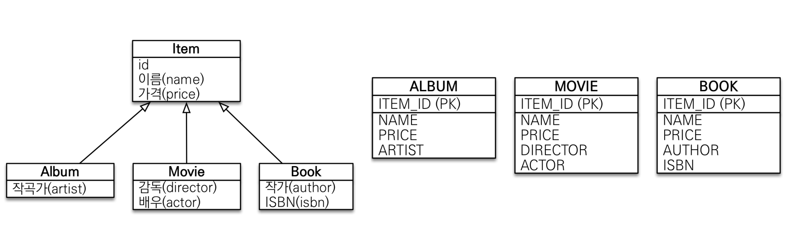
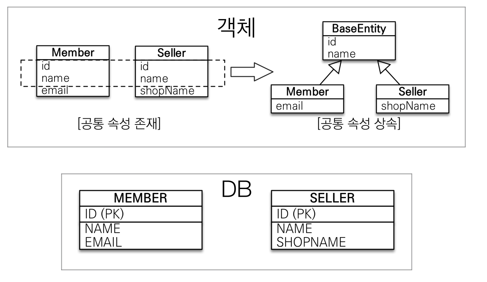

### JPA 실무에서 어려운 이유
- 실무는 수십 개 이상의 복잡한 객체와 테이블 사용
### 목표 - 객체와 테이블 설계 매핑
- 객체와 테이블을 제대로 설계하고 매핑하는 방법
- 기본 키와 외래 키 매핑
- 1:N, N:1, 1:1, N:N 매핑
- 실무 노하우 + 성능까지 고려
- 어떤 복잡한 시스템도 JPA로 설계가능
### 목표 - 내부 동작 방식 이해
- JPA 의 내부 동작 방식을 이해하지 못하고 사용
- JPA 내부 동작 방식을 그림과 코드로 자세히 설명
- JPA가 어떤 SQL을 만들어 내는지 이해
- JPA가 언제 SQL을 실행하는지 이해
### SQL 중심 개발의 문제
- SQL을 계속 작성해 줘야 한다는게 문제다...
- 문제는 간단한 select도 모두 작성을 해야 하는것이 문제다.
### JPA를 왜 사용해야 하는가?
- SQL중심적인 개발에서 객체 중심적인 개발로 변경
- 생산성
  - 메서드 하나로 DB 데이터의 빠른 수정 가능
- 유지보수
  - DB 유지보수 어려움, JPA는 필드만 추가해 주면 됨
- 패러다임의 불일치 해결
- 성능
- 데이터 접근 추상화와 벤더 독립성
- 표준
### 데이터 베이스 방언

- 방언: SQL 표준을 지키지 않는 특정 DB만의 고유한 기능
- JPA는 특정 데이터베이스에 종속적이지 않다.
- 각각의 DB가 제공하는 SQL 문법과 함수는 조금씩 다름

### JPA구동방식


### JPA 사용 주의점
- 엔티티 매니저 팩토리는 하나만 생성해서 애플리케이션 전체에서 공유
- 엔티티 매니저는 쓰레드간에 공유하지 말아야 한다.
- JPA의 모든 데이터 변경은 트랜잭션 안에서 실행

### JPQL 
- JPA는 SQL을 추상화한 JPQL 이라는 객체 지향 쿼리 언어 제공
- SQL과 문법은 비슷하다
- JPQL은 엔티티 객체를 대상으로 쿼리
- SQL은 데이터베이스 테이블 대상으로 쿼리
### JPA에서 가장 중요한 2가지
- 객체와 관계형 데이터 베이스 매핑하기
- 영속성 컨텍스트
### 엔티티 매니저 팩토리와 엔티티 매니저


### 영속성 컨텍스트
- JPA를 이해하는데 가장 중요한 용어
- 엔티티를 영구 저장하는 환경
- EntityManager.persist(entity) : 이는 엔티티를 DB에 저장하는 것이 아닌 영속성 컨텍스트에 저장하는 것을 의미한다.
### 엔티티 생명 주기
- 비영속
  - 영속성 컨텍스트와 전혀 관계가 없는 새로운 상태 : JPA와 관계가 없음
- 영속
  - 영속성 컨텍스트에 관리되는 상태
  - em.persist(entity); 를 통해 엔티티를 영속성 컨텍스트 안에 저장하는 상태
- 준영속
  - 영속성 컨텍스트에 저장되어 있다가 분리
- 삭제
-  삭제된 상태
```java
    // 비영속
    Member sectionMember = new Member();
    sectionMember.setId(100L);
    sectionMember.setName("Lee");
    // 영속
    em.persist(sectionMember);
    // 준영속
    em.detach(sectionMember);
    // 삭제
    em.remove(sectionMember);
```
### 영속성 컨텍스트의 이점
- 1차 캐시
  - 1차 캐시를 사용함으로 서 만약 1차 캐시에 엔티티가 있으면 해당 엔티티를 가져오고 그렇지 않는 경우 DB에 접근해서 가져온다.
  - 이후 가져온 데이터를 1차 캐시에 넣는다.
  - 
- 동일성 보장
  - 같은 트랜잭션 안에서 동일한 엔티티를 찾으면 같은 데이터를 가져올 수 있다.
- 트랜잭션을 지원하는 쓰기 지연
  - persist한다고 해서 바로 sql을 보내는 것이 아닌 트랜잭션 커밋이 이루어 졌을때 sql이 나간다
  - 
  - 
- 변경 감지 dirty checking + 플러쉬
  - jpa로 데이터를 가져오 setter로 데이터를 저장후 commit 하게 되면 jpa는 자동으로 변경된 값을 update query를 만들어 보낸다
  - 
  - 플러쉬란?
    - 영속성 컨텍스트의 변경 내용을 Db에 반영 한다.
    - 변경감지 -> 스정된 엔티티를 쓰지 지연 sql 저장소에 등록 -> 쓰기 지연 sql 저장소의 쿼리를 DB 에 전송(커밋은 되지 않는다.)
  - 플러쉬 하는 법
    - 직접 호출 : em.flash();
    - 트랜잭션 커밋 : flash 자동 호출
    - JPQL 커밋 : flash 자동 호출
### 엔티티 매핑 소개
- 객체와 테이블 매핑 : @Entity , @Table
- 필드와 컬럼 매핑 : @Column
- 기본 키 매핑 : @Id
- 연관관계 매핑 : @ManyToOne , @JoinColumn
### hibernate.hbm2ddl.auto option
- create : 새로만듬
- create-drop : application down시 drop
- update : 새로운 커럼 변경점 생성시 table update (alter로 컬럼생성)
- validate : entity와 table colmn 정상 매핑 확인
- none : 사용하지 않음
- 주의점
  - ※운영 장비에는 절대 create, create-drop, update 사용하면 안된다.※
  - 개발 초기 단계에는 create 또는 update
  - 테스트 서버는 update 또는 validate
  - 스테이징과 운영 서버는 validate 또는 none
### Table Annoatation


### mapping Annotation


### column Annotation


### table 전략
- 키 생성 전용 테이블을 하나 만들어서 데이터베이스 시퀀스를 흉내내는 전략
- 장점: 모든 데이터베이스에 적용가능
- 단점: 성능

### 권장하는 시별자 전략
- 기본 키 제약 조건 : null 아님, 유일, 변하면 안된다.
- 미래까지 이 조건을 만족하는 자연키는 찾기 어렵다. 대리키(대체키)를 사용하자.
- 권장 : Long형 + 대채키 + 키 생성전략 사용

### IDENTITY 전략
- GeneratedValue전략에서 IDENTITY를 사용하게 되면 기본키 생성을 DB에가 위임한다.
- 즉, PK값을 DB에 들어가야 지만 알 수 있다.
- 이렇게 지금까지의 내용으로 영속성 컨텍스트가 될 수없다. em.persist를 1차 캐시에서 key가 PK로 들어가함으로.
- 때문에 IDENTITY를 사용하게 되면 persist할때 바로 flash 이뤄진다.

### 데이터 중심 설계의 문제점
- 현재 방식은 객체 설계를 테이블 설계에 맞춘 방식
- 테이블의 외래키를 객체에 그대로 가져옴
- 객체 그래프 탐색이 불가능
- 참조가 없음으료 UML도 잘못됨

## 연관관계 매핑 기초
### 목표
- 객체와 테이블 연관관계의 차이를 이해
- 객체의 참조와 테이블의 외래 키를 매핑
- 용어 이해
  - 방향 : 단방향, 양방향
  - 다중성 : 1:N, N:1, 1:1 ,N:N
  - 연관관계의 주인 : 객체 양방향 연관관계는 관리 주인이 필요
### 연관관계의 주인
- 양방향 매핑 규칙
  - 객체의 두 관계중 하나를 연관관계의 주인으로 지정
  - 연간관계의 주인만이 외래 키를 관리(등록,수정)
  - 주인이 아닌 쪽은 읽기만 가능(readonly 속성을 가짐)
  - 주인은 mappedBy 속성 사용하지 않는다.
  - 주인이 아니면 mappedBy 속석으로 주인 지정
- 누구를 주인으로 할꺼지?
  - 외래 키가 있는 곳을 주인으로 정해라.
### 연관관계 설정할 때 주의점.
1. readonly 주인이 아닌쪽에서 값을 add 하는 경우 발생하는 문제
   - ```java
            TwoWaySection5Member member = new TwoWaySection5Member();
            member.setName("member1");
            em.persist(member);

            TwoWayTeam twoWayTeam = new TwoWayTeam();
            twoWayTeam.setName("TwoWayTeam A");
            em.persist(twoWayTeam);
     ```
   - 위 같은 상황에서는 member의 team이 연관관계의 주인 속성을 가지고 있다.
   - 즉 team의 pk가 member.team_id로 이뤄지는데 위 코드는 team의 pk가 생성되지 않는 상태에서 member.team_id를 넣는 것과 같다.
   - 따라서,member.setTeam(team)을 해주는 방법을 선택하거나 아니면 team을 먼저 생성하고 member에 setTeam(team)을 해주는 방법을 채택한다.
2. 양방향 매핑을 사용할때 양쪽에다 값을 전부 넣어야 한다.
```java
        TwoWayTeam twoWayTeam=new TwoWayTeam();
        twoWayTeam.setName("TwoWayTeam B");
        em.persist(twoWayTeam);

        TwoWaySection5Member member=new TwoWaySection5Member();
        member.setName("member2");
        member.setTeam(twoWayTeam);
        em.persist(member);

        twoWayTeam.getMembers().add(member);

//  em.flush();
//  em.clear();
        System.out.println("================================");
        TwoWayTeam twoWayTeam1=em.find(TwoWayTeam.class,twoWayTeam.getId()); //select team query 날라감
        List<TwoWaySection5Member> members=twoWayTeam1.getMembers(); //select member query 날라감

        for(TwoWaySection5Member twoWaySection5Member:members){
        System.out.println("twoWaySection5Member = "+twoWaySection5Member.getName());
        }

        transaction.commit();
```
- 위와같이 양방향 매핑을 해주는 경우 getMembers()에 .add() 해줘야 한다.
- 그 이유는 add 해주지 않았을 경우 flash,clear를 해주지 않았을때 em.find는 1차 캐치에서 값을 찾아온다.
- 이때 해당 캐시에는 메모리에 있음으로 twoWayTeam1.getMembers()를 했을때 값이 없다.
- 해당 문제를 방어하기 위해서 양방향 매핑을 해줄때 값을 넣어 주는것이 맞다.
- 권장하는 방법은 member의 teamSetter에서 team.getMembers().add(this)를 해주는 방법과
- ```java
    public void setTeam(TwoWayTeam twoWayTeam) {
        this.twoWayTeam = twoWayTeam;
        twoWayTeam.getMembers().add(this);
    }
- team에서 addMember해주는 method를 생성해서 넣는 방법을 권장한다.
- ```java
    public void addMember(TwoWaySection5Member member) {
        member.setTeam(this);
        members.add(member);
    }
3. 양방향 매핑시 무한루프 조심하기
- lombok을 사용할때 toString을 사용하면 양방향으로 계속 호출하는 문제가 있다.
- 따라서 lombok에서 toString을 사용하지 말아야 한다.
- 만약 controller에서 엔티티를 반환해야 한다면 별도의 DTO를 만들어서 사용해야 한다.
  - 엔티티를 반환할때 만약 엔티티가 변경된다고 하면 API 스팩이 변경되는 것이기 때문에 문제가 발생할 수 있다.
### 정리
- 양방향 연관관계를 바로 설계하기 보다는 단방향으로 먼저 설계를 완료 하고 양방향을 필요할때 추가 하는 것이 좋다.
- 이때 양방향을 설계해야 겠다는 판단하는 기준은 JPQL로 역방향을 탐색해야 하는 경우가 있는 경우에 해야한다.
- 연관관계의 주인은 외래 키의 위치를 기준으로 정해야 한다. (외래키가 들어가는 곳이 주인)
### 연관관계의 주인
- 테이블은 외래 키 하나로 두 테이블이 연관관계를 맺음
- 객체의 양방향 관계는 A->B, B->A 처럼 참조가 단방향 2개로 이뤄져 있다.
- 따라서 둘중 외래키를 관리할 곳을 지정해야 한다.
- 그것을 주인으로 생각하며 FK가 있는 객체, 즉 N쪽을 주인으로 잡아야 한다.
### 1:1 관계
- 주 테이블이나 대상 테이블 중에 외래 키 선택가능
  - 주 테이블에 외래 키
  - 대상 테이블에 외래 키
- 외래 키에 데이터베이스 유니크 제약조건 추가
- 주 테이블에 외래키 vs 대상 테이블에 외래키
  - 주 테이블에 외래 키
    - 객체지향 개발자 선호
    - JPA 매핑 편리
    - 장점 : 주 테이블만 조회해도 대상 테이블에 데이터가 있는지 바로 확인 가능
    - 단점 : 값이 없으면 외래 키에 null 허용
  - 대상 테이블에 외래키
    - 전통적인 DB 개발자 선호
    - 장점 : 테이블 구조 유지 가능
    - 단점 : 프록시 기능의 한계로 지연 로딩으로 설정해도 항상 즉시 로딩 됨.
### N:N
- 관계형 DB는 정규화된 테이블 2개로 N:N 관계를 표현할 수 없음
- 따라서 연결 테이블을 추가해서 1:N, N:1 관계로 풀어나가야 함.
- 근데 객체는 N:N이 가능한 구조로 만들수 있지만 사용하면 안된다.
- 그럼 무엇을 사용해야 할까?
- ManyToMany를 중간에 테이블을 하나 두고 ManyToOne 과 OneToMany로 변경해야 한다.

### 상속관계 매핑
- RDB에는 상속관계가 없다.
- 슈퍼타입 서브타입 관계라는 모델링 기법이 객체 상속과 유사
- 상속관계 매핑: 객체의 상속과 구조와 DB의 슈퍼타입 서브타입 관계를 매핑

strategy = InheritanceType.JOINED)
### @Inheritance
- @DiscriminatorColumn를 사용하면 자동으로 dtype을 만들어준다.
- @DiscriminatorValue를 사용하게 되면 하위 클래스의 dtype을 지정해 줄 수 있다.(이건 굳이 필요 없을 수도?!)



1. 조인 전략으로 사용하는 방법: (strategy = InheritanceType.JOINED) 로 지정하면 조인전략으로 사용할 수 있다.
   - 장점
     - 정규화 되어 있음
     - 외래키 참조 무결성 제약 조건 사용가능
     - 저장공간의 효율화
   - 단점
     - 조회시 조인 필수로 사용
     - 쿼리 복잡해 짐
     - insert query 2번 나감..


2. 싱글 테이블로 사용하는 방법: (strategy = InheritanceType.SINGLE_TABLE)로 지정하면 사용가능
   - 장점
      - 쿼리가 단순해 진다. 
      - 조인을 사용하지 않기 때문에 성능적으로 좋다. 
      - dtype이 필수다.: 해당 row가 어떤 타입의 데이터인지 확인 불가능
   - 단점
     - 하지만 TABLE이 컬럼이 너무 많아서 복잡함...
     - null 허용해야한다.


3. 구현 클레스마다 테이블 전략 : (InheritanceType.TABLE_PER_CLASS)로 지정한다.
   <p style="color: red"> 이건 사용하면 안된다.</p>
   - 부모 클레스를 추상클레스로 지정하고 InheritanceType.TABLE_PER_CLASS를 사용하면 슈퍼 테이블은 테이블 생성이 안되고 서브 테이블만 테이블이 생긴다.

### MappedSuperclass


- 공통적인 컬럼이 있는 경우 사용할 수 있다.
- BaseEntity를 하나 만들어서 @MappedSuperclass를 선언해 준후 column을 선언한다.
- 이후 공통적인 컬럼을 가진 Entity에 해당 class를 상속받으면 해당 BaseEntity의 컬럼이 적용된다.
- 이때 컬럼명을 변겅하고 싶으면 @colnum(name="")을 사용하면 끗
- 하위 클래스 모두에게 적용되는 것은 아니고 바로 하위 클래스에만 적용된다.
- 직접 생성해서 사용하는 것이 아님으로 추상클레스 권장
