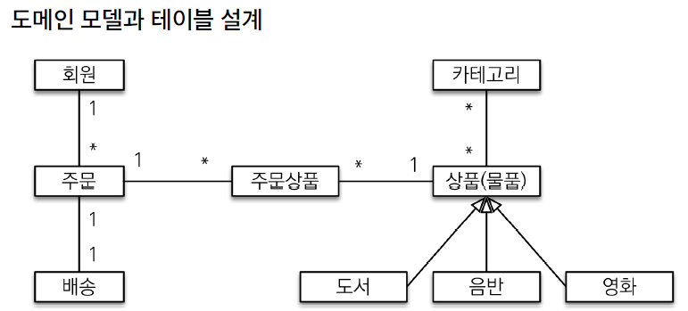
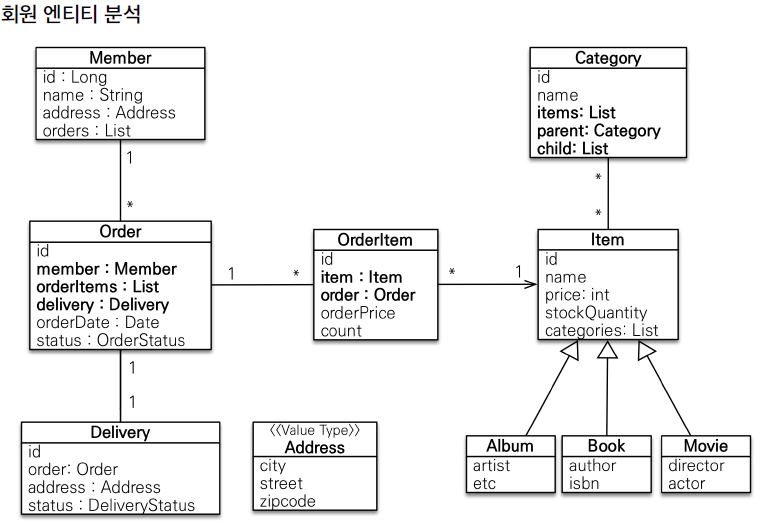
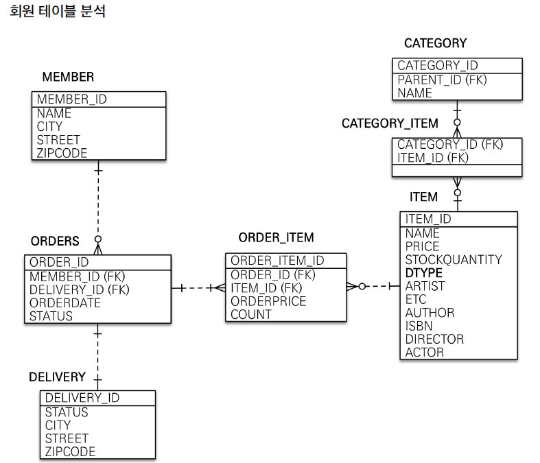

# 

### 프로젝트 환경설정
@PersistenceContext : springboot에 해당 어노테이션이 있으면 자동으로 DI를 진행한다.

trouble shutting
1. Test Class에서 @RunWith가 사용이 안되는 이유
   - 스프링부트 2.x에서는 RunWith로 SpringRunner.class 를 넣어줬어야 했다.
   - 이는 JUnit4를 사용하겠다는 의미를 내포한다. (SpringRunner는 SpringJunit4ClassRunner의 alias다. )
   - 근데 부트 3.x에서는 JUnit5를 사용한다.
   - 즉 JUnit4는 부트 3.x에서 사용할 수 없다.
   - 그러면 어떻게 JUnit5를 사용할까?
   - @SpringBootTest안에 이미 @ExtendWith에 SpringExtension.class가 있다.
   - SpringExtension.class는 JUnit5를 통합한 클래스다.
   - 따라서 @SpringBootTest만 선언하면 JUnit을 자동으로 사용할 수 있다.

### 도메인 분석 설계



- member 와 order를 설계할때 회원을 기준으로 order가 생성되는것으로 생성된다고 하는 것 보다 주문이 생성될때 회원이 필요하다고 보는 것이 옳다.



### 엔티티 클래스 개발
- foreign key를 잡아주는 것은 시스템 마다 다르다.
  - 만약 시스템이 동작하는것이 더 중요하면 잡아줄 필요는 없다
  - 하지만 돈과 관련된 약간 중요한 부분들은 잡아주는 것이 좋다
- getter는 사용해도 무방하지만 setter는 고민을 해봐야 한다.
  - read와 write가 시스템에 미치는 영향은 굉장히 차이가 크다
- PK컬럼을 지정할때 컬럼명을 id라고 적어도 무방하지만 talbe name + _id로 생성하는 것이 조금 더 명확하다.(관례상 더 많이 사용한다.)
- 값 타입은 변경 불가능하게 설계해야 한다.
  - JPA 는 java reflection을 사용해야 하기 때문에 생성자가 필요하다.
### 엔티티 설계시 주의점
- setter 사용 금지 : 변경 포인트가 너무 많아서 유지보수가 어렵다.
- 모든 연관관계는 지연 로딩으로 설정
  - 즉시 로딩이란 하나의 데이터에 접근할 때 연관된 모든 데이터를 조회하는 것을 즉시 로딩이라고 한다.
  - 즉시 로딩은 예측이 어렵고 어떤 sql이 실행될지 추적하기 어렵다. 특히 JPQL을 실행할 때 N+1문제가 자주 발생한다.
- 만약 연관된 엔티티를 할께 DB에서 조회하려면 fetch join또는 엔티티 그래프 기능을 사용한다.
- @XToOne은 fetch= FetchType = lazy로 변경해야 한다. : default가 EAGER로 되어 있다.
- 컬렉션은 필드에서 초기화 하자
  - 하이버네이트는 엔티티를 영속화 할때 컬렉션을 감싸서 하이버네이트가 제공하는 내장 컬랙션으로 변경한다
  - getOrders(); 와 같이 임의의 메서드에서 컬렉션을 잘못 사용하면 하이버네이트 내부 메커니즘에 문제가 발생할 수 있다.
### 테이블,컬럼명 생성 전략
- 스프링 부트에서 하이버네이트 기본 매핑 전략을 변경해서 실제 테이블 필드명은 다르다.
  - 카멜 케이스 -> 언더 스코어 (memberPoint -> memeber_point)
  - .(점) -> 언더 스코어
  - 대문자 -> 소문자
- 적용 2단계
  - 논리명 생성 : 명시적으로 컬럼, 테이블 명을 직접 적지 않으면 ImplicitNamingStrategy생성
  - 물리명 적용 : 모든 논리명에 적용 됨, 실제 테이블에 적용

### JOQL 과 SQL의 차이
- 기능적으로는 동일하지만 쿼리하는 대상이 다름
- JPQL의 경우 Entity 대상으로 하기 때문에 alias를 사용해야 한다
  - JPQL : select m from member m;
  - SQL : select * from member;

### Annotation 우선순위
1. method 상단
2. class

### EntityManager DI
- EntityManager를 DI할때 @PersistenceContext(표준임)를 사용해야 한다.
- 근데 spring boot가 @AutoWired로 DI가 될 수 있도록 개선되었다.
- 따라서 생성자 주입을 사용할 수 있다.

### Test Case에서 rollback
- @Tranctional한 상황에서 Test Case를 작성하여 동작하면 DB에 commit되지 않는다.
  - Test Case에서는 Commit할 필요가 없음으로 자동으로 RollBack해준다.
- 따라서 insert query또한 생성되지 않는다.
- 만약 insert query 를 날라고 Roll Back을 하고싶은 경우
  - EntityManeger의 flash함수를 이용해서 insert query를 날리도록 한다.
- 이렇게 되면 자동적으로 transectional한 상황에서 insert query는 날라가지만 rool back이 되는 상황으로 만들어 진다
```java
    @Test
        public void 회원가입() throws Exception{

        //given
        Member member = new Member();
        member.setName("hwang");
        //when
        Long joinedId = memberService.join(member);
        em.flush();

        //then
        Assertions.assertEquals(member , memberRepository.findOne(joinedId));
        }
```